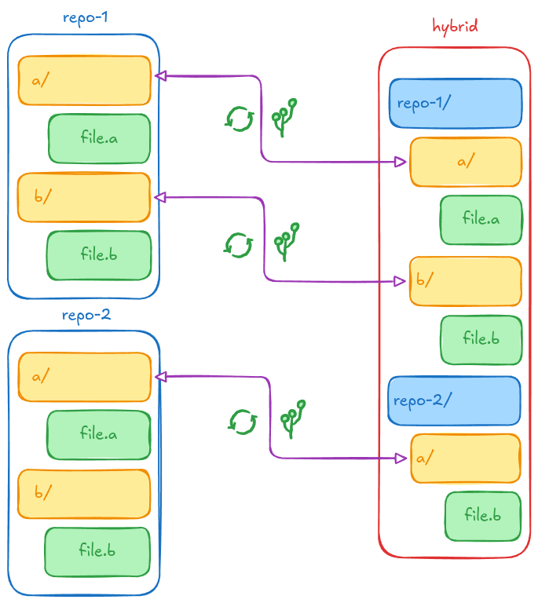

# hybrid syncer

`hybrid-syncer` is a lightweight Python CLI wrapper around [Copybara](https://github.com/google/copybara). It simplifies multi-repository code synchronization by reading a declarative YAML manifest (`sync-manifest.yaml`), automatically generating Copybara Starlark (`copy.bara.sky`) configuration files, executing `push`, `pull`, `list`, `status`, and `doctor` operations.



## Prerequisites & Installation

1. **Python 3.8+** with `PyYAML`:
   ```bash
   pip install pyyaml
   ```
   - installing pyaml from a `packages.tar.gz`
   ```bash
   # download the packages from somewhere else
   pip download pyaml -d packages
   # compress the packages
   tar czvf packages.tar.gz packages/

   # decompress on the machine
   tar xvf packages.tar.gz
   # create a virtual environment on the machine
   python -m venv .venv
   # activate it
   source .venv/bin/activate
   # or on windows
   .venv\Scripts\activate

   # then install the pyaml
   pip install --no-index --find-links=packages/ pyaml
   ```
2. **Copybara**: Ensure the `copybara` executable is in your system `PATH` (e.g. at `~/.local/bin/copybara` or `/usr/local/bin/copybara`). Also you can explicitly include the `copybara`'s `PATH` in `sync-manifest.yaml` with  `copybara_path`.
   ```bash
   # to download http enforcement disabled patch use the script
   chmod +x install_copybara.sh
   ./install_copybara.sh
   ```
   ```yaml
   # sync-manisfest.yaml
   # ...
   copybara_path: "./bin/copybara_deploy.jar"
   # ...
   ```
3. **Git**: Installed and available in `PATH`.

Make `hybrid-syncer.py` executable:
```bash
chmod +x hybrid-syncer.py
```

For more information please refer to `DOCS.md`.